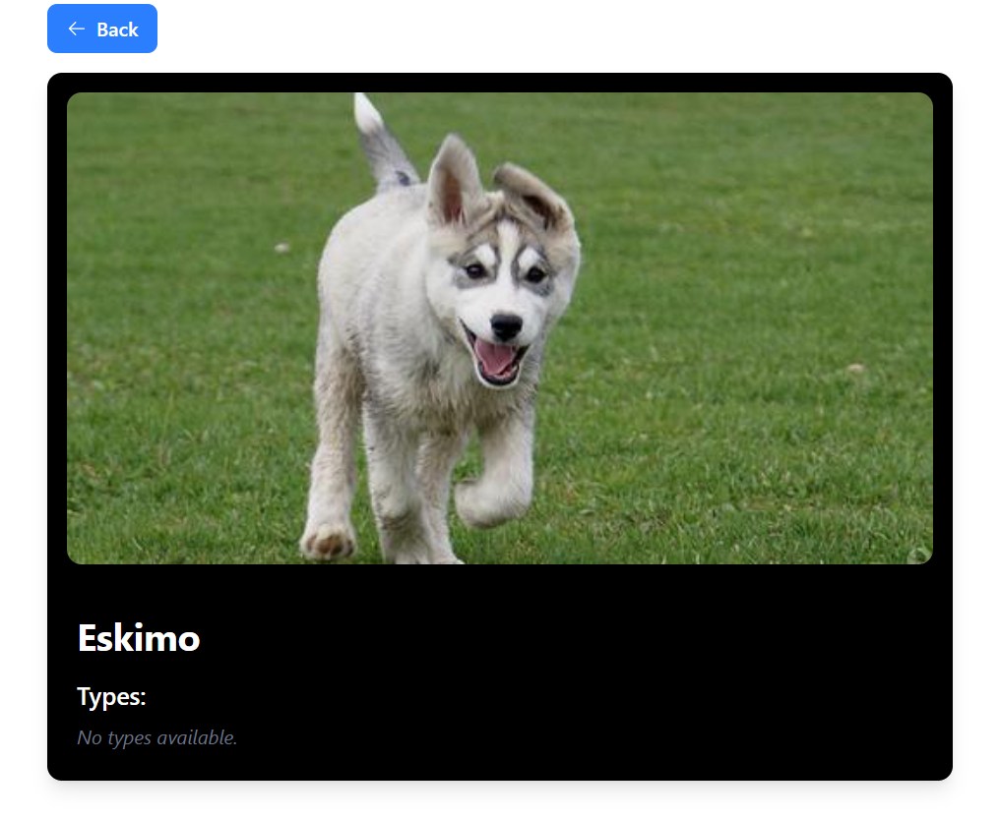
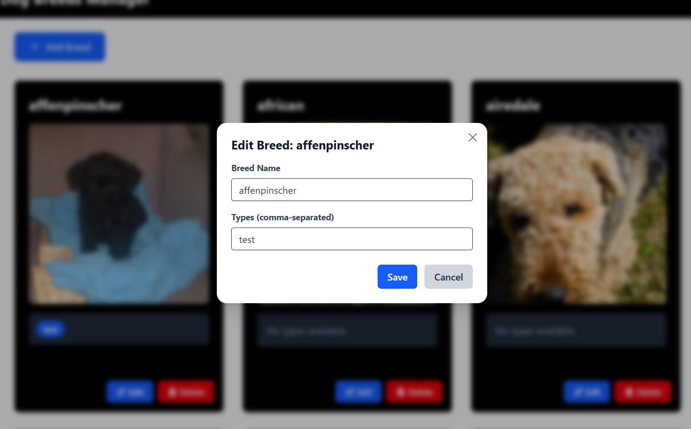
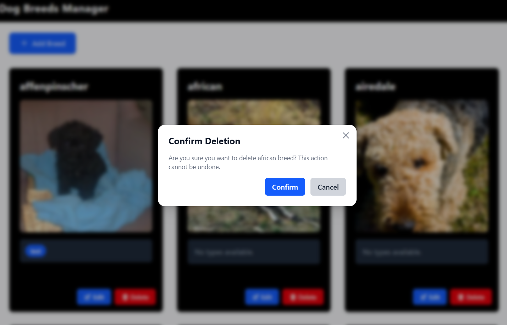

# 🐶 Dog Breed Application

This is a full-stack web application designed to manage a collection of dog breeds and their associated types. The application consists of a **React** frontend and a **Node.js (Express)** backend API.

---

# 🚀 Live Demo

🚀 Live Demo on Render
Experience the Dog Breed Manager live! This application is deployed on Render.com, a cloud platform for hosting web applications.

**Frontend Application**:
Navigate to the live frontend application in your browser:
https://dog-breed-manager-frontend.onrender.com

**Backend API**:
The backend API serves data to the frontend and provides endpoints for managing dog breeds. You can explore its documentation via Swagger UI:
https://dog-breed-manager-backend.onrender.com/

---

# ✨ Features

- **Browse Dog Breeds**: Explore a comprehensive list of various dog breeds.

- **Search Functionality**: Easily find specific dog breeds using a dynamic search bar with real-time suggestions.

- **Breed Details**: View detailed information for each breed, including available types.

- **Add New Breeds**: Securely add new dog breeds and their types to the database.

- **Update Breed Information**: Modify existing breed types.

- **Delete Breeds**: Remove breeds from the collection.

- **Pagination**: Navigate through large datasets of dog breeds efficiently.

- **Responsive Design**: Enjoy a seamless experience on both desktop and mobile devices.

- **Interactive Animations**: Delightful dog-themed animations enhance the user experience.

- **Centralized Logging**: Robust logging powered by Winston for better error tracking and application monitoring.

# 📸 Screenshots

Here are some glimpses of the Dog Breed Manager in action:

- **Homepage / Search View**
  

  

- **Breed Details**
  
- **All Breeds Dashboard**
  
- **Add/Edit Breed Modal**
  

- **Confirmation Modal**
  
- **Add Breed**
  

## 💻 Technologies Used

### Frontend

- **React**: JavaScript library for building UIs.
- **Tailwind CSS**: Utility-first CSS framework for styling.
- **Headless UI**: Completely unstyled, fully accessible UI components for React.
- **Hero Icons**: A set of free MIT-licensed high-quality SVG icons.
- **Jest**: JavaScript testing framework.
- **React Testing Library**: For testing UI components from a user’s perspective.
- **Mock Service Worker (MSW)**: For mocking API responses in development/testing (unit tests used direct Jest mocks).

### Backend

- **Node.js**: JavaScript runtime environment.
- **Express.js**: Minimalist web framework for Node.js.
- **Jest**: For backend unit/integration tests.
- **Supertest**: HTTP assertions for Express endpoints.
- **Dotenv**: For managing environment variables.
- **Data Storage**: Connect backend to a persistent database MongoDB Atlas.
- **CORS**: Middleware to enable Cross-Origin Resource Sharing.
- **Swagger-UI-Express**: For serving API documentation (Swagger/OpenAPI).
- **Winston**: A versatile logging library for Node.js.

---

## ⚙️ Setup and Installation

### Prerequisites

- **Node.js** (LTS recommended)
- **npm** or **Yarn**

---

### 1. Clone the Repository

```bash
git clone https://github.com/Arpitha-nc/Dog-Breed-Manager.git
cd Dog-Breed-Manager

```

### 2. Backend Setup

```bash
cd backend
npm install
```

Environment Variables
Create a .env file inside the backend/ directory:

```bash
PORT = 3000
MONGODB_URI = mongo connection string
NODE_ENV = "development"
```

### 3. Frontend Setup

```bash
   cd ../frontend
   npm install
```

▶️ Running the Application

### 1. Start the Backend Server

```bash
cd backend
npm run dev
```

Runs on: http://localhost:3000

### 2. Start the Frontend Application

```bash
cd frontend
npm start
```

Runs on: http://localhost:5173

✅ Running Tests
Backend Tests

```bash
cd backend
npm run test
```

- Verifies CRUD operations (/dogs, /dogs/:id)
- Handles status codes, errors (400, 404), and data validation
- Skips real DB connection during testing

Frontend Tests

```bash
cd frontend
npm test
```

- Tests UI behavior via Jest + React Testing Library
- Uses jest.mock() for mocking API

🚀 Future Enhancements

- Implement user authentication and authorization
- Add detailed breed info (e.g., origin, temperament)
- Add filter and sort features
- Improve error messages and UI feedback
